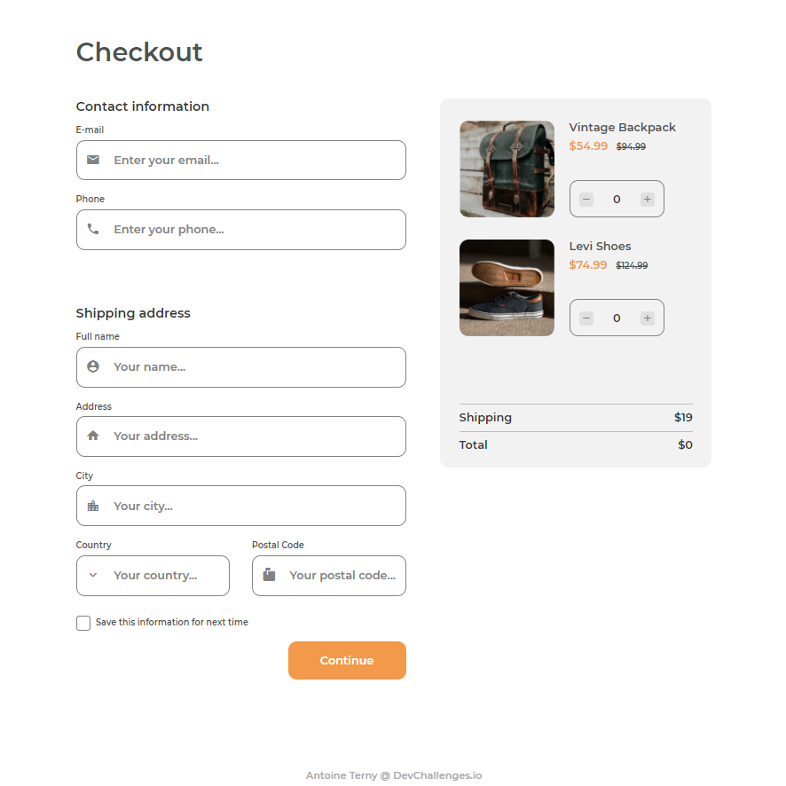

<!-- Please update value in the {}  -->

<h1 align="center">Checkout Page</h1>

<div align="center">
   Solution for a challenge from  <a href="http://devchallenges.io" target="_blank">Devchallenges.io</a>.
</div>

<div align="center">
  <h3>
    <a href="https://devchallenges-checkout-page-react.vercel.app/">
      Demo
    </a>
    <span> | </span>
    <a href="https://github.com/antoineterny/devchallenges-checkout-page-react">
      Solution
    </a>
    <span> | </span>
    <a href="https://devchallenges.io/challenges/0J1NxxGhOUYVqihwegfO">
      Challenge
    </a>
  </h3>
</div>

<!-- TABLE OF CONTENTS -->

## Table of Contents

- [Overview](#overview)
  - [Built With](#built-with)
- [Features](#features)
- [Contact](#contact)
- [Acknowledgements](#acknowledgements)

<!-- OVERVIEW -->

## Overview

[](https://devchallenges-checkout-page-react.vercel.app/)

It's not easy to style forms with CSS, and this was a good challenge in this regard.
Even if it's not required, I started to write a quick vanilla JS script to handle the shopping cart, and then realized it would be the perfect opportunity to build my first React app.
I had a hard time coding it, but with the help of a Mosh tutorial, I eventually found my way and I'va learnt a lot with this project.

### Built With

<!-- This section should list any major frameworks that you built your project using. Here are a few examples.-->

- [React](https://reactjs.org/)
- [Create React App](https://create-react-app.dev/)
- [Sass](https://sass-lang.com/)

## Features

<!-- List the features of your application or follow the template. Don't share the figma file here :) -->

This application/site was created as a submission to a [DevChallenges](https://devchallenges.io/challenges) challenge. The [challenge](https://devchallenges.io/challenges/0J1NxxGhOUYVqihwegfO) was to build an application to complete the given user stories.


## How To Use

To clone and run this application, you'll need [Git](https://git-scm.com) and with [npm](http://npmjs.com) installed on your computer. From your command line:

```bash
# Clone this repository
$ git clone https://github.com/antoineterny/devchallenges-checkout-page-react

# Install dependencies
$ npm install

# Run the app
$ npm start
```

## Acknowledgements

<!-- This section should list any articles or add-ons/plugins that helps you to complete the project. This is optional but it will help you in the future. For exmpale -->

- [Programming with Mosh - React Tutorial for Beginners](https://www.youtube.com/watch?v=Ke90Tje7VS0&t=1s)
- [Custom Select Styles with Pure CSS](https://moderncss.dev/custom-select-styles-with-pure-css/) (I must admit I didn't go to the end of the idea of styling the select tag...)

## Contact

- Website [antoineteny.com](https://antoineterny.com/)
- GitHub [@antoineterny](https://github.com/antoineterny/)
